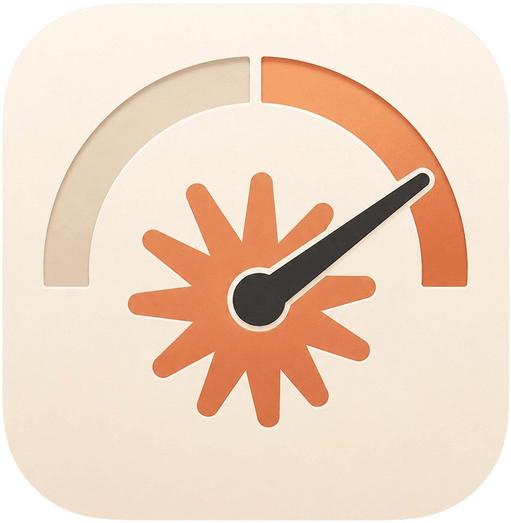
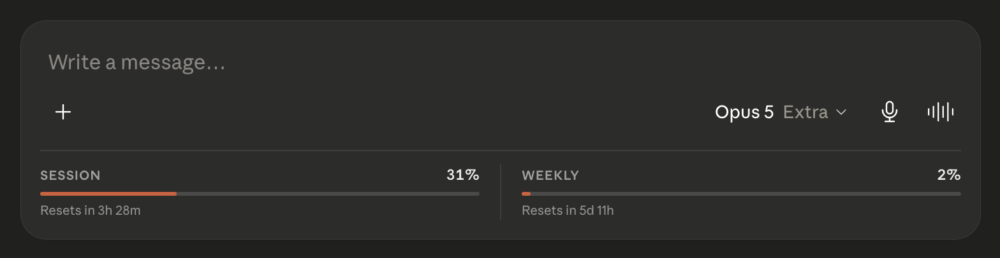

# Claude Usage Meter

A Chrome extension that shows your **Claude.ai session (5h)** and **weekly (7d)** usage limits directly inside the message composer - no need to guess how close you are to hitting a rate limit.



---

## Features

- 📊 Inline usage bar embedded directly into Claude's own composer UI - not a floating overlay
- ⏱ Live "Resets in Xd Xh" / "Xh Xm" / "Xm" countdowns for both session and weekly limits
- ⚡ Real-time updates while streaming - reacts instantly to usage changes, no waiting for a refresh
- 🔄 Background polling as a fallback, plus manual refresh from the popup
- 💾 Caches the latest snapshot locally - popup shows data instantly, then refreshes
- 🎨 Styled to blend into Claude's own UI - inherits theme colors, works in both light and dark mode
- 🧭 Works across `/new` and active chats without needing a page reload

---

## Installation

1. Download [`claude-usage-meter-0.1.0.zip`](../../releases/download/v0.1.0/claude-usage-meter-0.1.0.zip)
2. Go to `chrome://extensions` in Chrome
3. Enable **Developer mode** (toggle in the top-right corner)
4. Drag and drop the zip onto the page
5. Open [claude.ai](https://claude.ai) and start or open a conversation - the usage bar will appear inside the message composer

---

## How it works

Claude's own servers already track your usage internally. This extension doesn't invent or estimate any numbers - it simply:

1. Reads your organization ID from your existing Claude session
2. Requests your usage data using your already-authenticated browser session - no API key, no separate login
3. Normalizes the response into session and weekly usage buckets
4. Calculates percentages (`used / limit × 100`) and renders progress bars
5. Updates live as you chat, without waiting on a fixed refresh interval
6. Caches the latest snapshot locally so the popup opens instantly

No conversation content, message text, or personal data is read, stored, or transmitted anywhere. The extension only reads Claude's own usage metadata and displays it.

---

## Privacy

This extension:

- Does **not** collect, transmit, or store any data outside your own browser
- Does **not** read conversation content
- Only requests data from `claude.ai`'s own domain, using your existing session
- Stores only the latest usage snapshot locally in your browser (no history, no analytics, no external servers)

---

## Development

No build step or dependencies - load `chrome://extensions` → **Load unpacked** and point it at this folder.

```
src/
  background.js      service worker; resolves the org ID from the session cookie
  content.js         polls /usage, normalizes it, renders the composer bar
  injected.js        page-context fetch patch; sniffs org ID, usage and SSE limits
  usage-format.js    shared countdown/threshold formatting (content + popup)
  popup.{html,css,js}
```

---

## License

MIT - see [LICENSE](LICENSE) for details.
